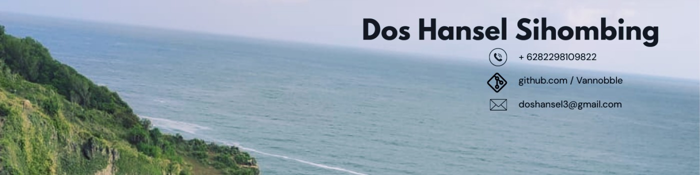

	

	
    
    

## 👨🏻‍💻 &nbsp;About Me:

👋 &nbsp;Hi there! I'm Dos, passionate about Computer Vision, Machine Learning, Teaching, and Robotics.

🔍 &nbsp;I'm actively seeking roles as a AI Engineer, Data Engineer, and Embedded Systems and Robotics Engineer.

🚀 &nbsp; I have a strong technical background in C++, Python, and more, and I love tackling complex challenges with innovative solutions.

📄 &nbsp;Check out my <a href="https://drive.google.com/drive/folders/1CGmtU9e9OTdiDHOwOaFtQsjA-DGRxmI8?usp=drive_link">Certifications</a> to learn more about my expertise and achievements.

🤝 &nbsp;Always open to new opportunities and collaborations—feel free to connect!

<!---
Vannobble/Vannobble is a ✨ special ✨ repository because its `README.md` (this file) appears on your GitHub profile.
You can click the Preview link to take a look at your changes.
--->
